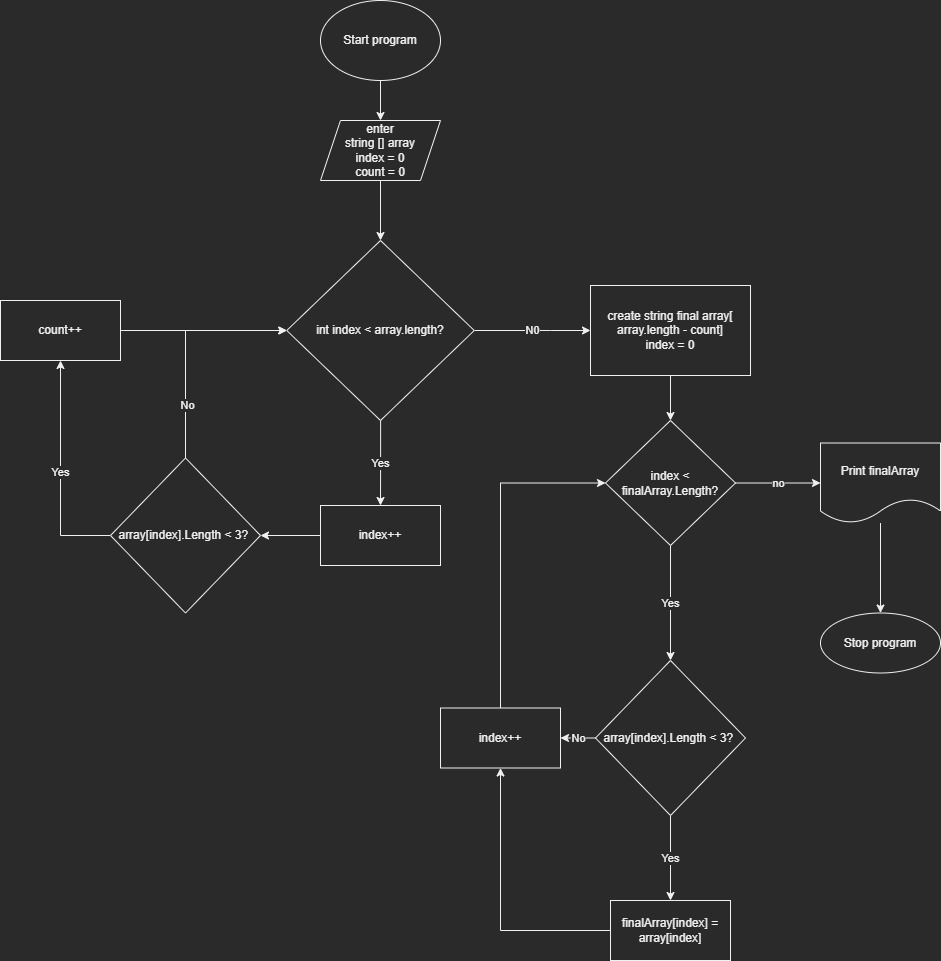

# Общая итоговя работа

## Описание задачи

Задача: Написать программу, которая из имеющегося массива строк формирует новый массив из строк, длина которых меньше, либо равна 3 символам. Первоначальный массив можно ввести с клавиатуры, либо задать на старте выполнения алгоритма. При решении не рекомендуется пользоваться коллекциями, лучше обойтись исключительно массивами.

Примеры:

[“Hello”, “2”, “world”, “:-)”] → [“2”, “:-)”]

[“1234”, “1567”, “-2”, “computer science”] → [“-2”]

[“Russia”, “Denmark”, “Kazan”] → []

## Решение задачи

1. Пользователь вводит массив. Для проверки массива пишется метод с рекурсией. Когда пользователь закончил вводить массив, он вводит пустое значение.
2. Введённый массив проверяется. В нйм ищется количество элементов с длинной строки больше 3.
3. Создаётся новый массив длиной равной длине введённого пользователем массива минус количество элементов с длинной строки больше 3. 
4. В новый массив записываются строки из старого массива, если их длина не больше 3. 
5. Массив выводится в консоль.

### Блок схема

